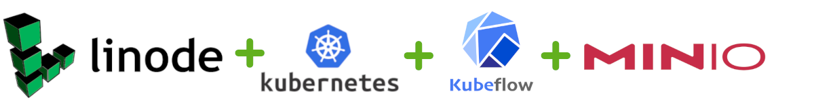

# Kubeflow Pipelines on Linode

We will use the following technologies:

- Linode (Cloud / Infrastructure provider)
- Kubernetes
- Kubeflow Pipelines
- MinIO (Cloud storage)

## Acknowledgements

- [MinIO Blog - Building an ML Data Pipeline with MinIO and Kubeflow v2.0](https://blog.min.io/building-an-ml-data-pipeline-with-minio-and-kubeflow-v2-0/)
- [Florian Pach's Kubeflow MNIST Pipeline on GitHub](https://github.com/flopach/digits-recognizer-kubeflow)
- [NetworkChuck's Kubernetes Video on Youtube](https://www.youtube.com/watch?v=7bA0gTroJjw)

