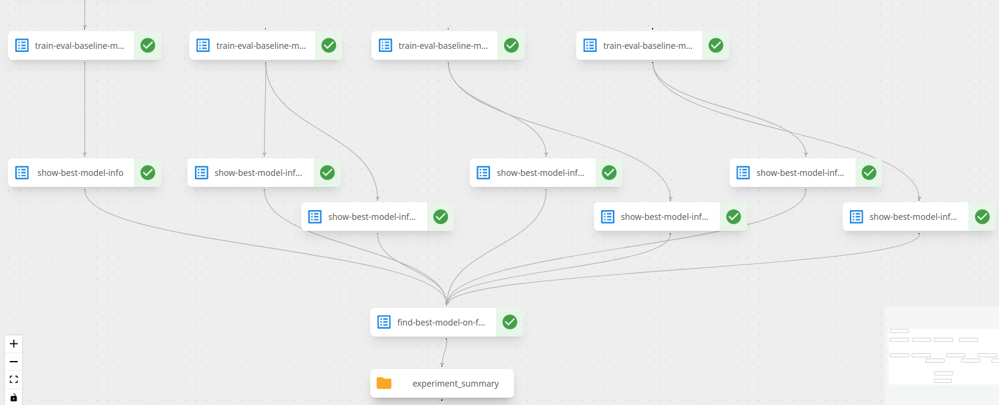
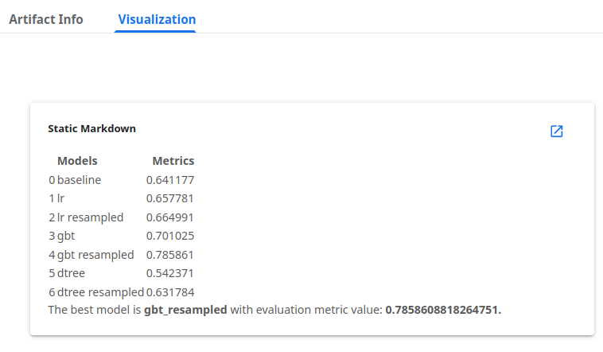

# 04. Model training and evaluation pipeline

---

**In this pipeline, we:** 

1. Use data from MinIO that was saved by a previous pipeline.
2. Use a Docker container to hold all of out training code for both the baseline and full models.
2. Using the container, train a simple baseline model using a single feature.
3. Using the container, train 3 additional models on all the features. B
4. Because of class imbalance, we also train on resampled data (via `imblearn.over_sampling.SMOTE`). This gives us $3 \times 2 = 6$ additional models.
5. We compare the performance of all the models and find out which one did the best.
6. The result of the experiment is displayed as a Markdown table.

**Following is the result of a successfull run:**

**Experiment results are collected in this table:**

