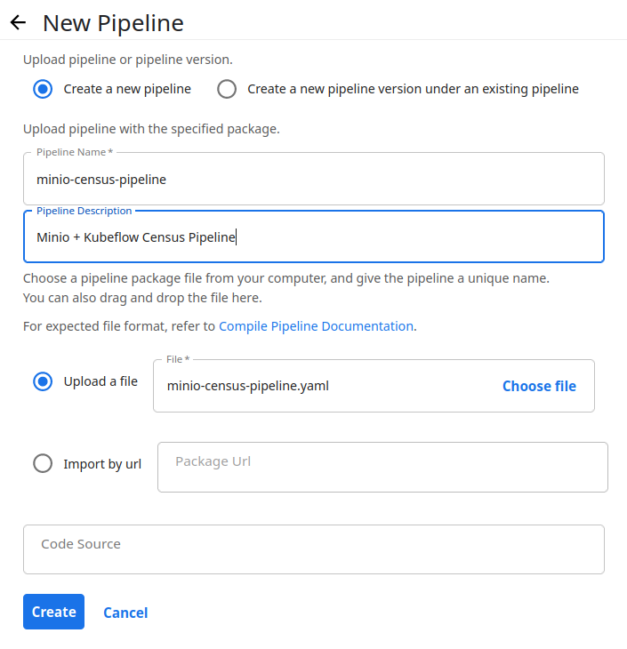

# Deploying Kubeflow Pipelines on Linode

## 1. Create an account on Linode and claim $100 credit


To claim $100 free credit, you can head over to any of Linde's documentation pages e.g. `https://www.linode.com/docs/guides/terraform-vs-helm/` and click on the banner callout. You will still have to add a payment method but there won't be any charge to your account as long as you stay within $100 limit.

This tutorial will create a fairly light-weight cluster that costs a maximum of $36 per month so you're more than covered.

## 2. Create Kubernetes cluster

After logging in, go to Kubernetes tab on the left pane.


Click on 'Create Cluster', this will take you to configuration page:


Choose a location that is closer to you. For worker nodes, we can use Shared CPU with the cheapest option as shown. This is more than enough for our purposes. Once satisfied, click on 'Create Cluster'. It will take a few seconds, then you'll be redirected to the following screen which shows the resources being provisioned for you.


After a few minutres, you'll get the green signal. This means that your cluster has been deployed and ready to use. Exciting!


## 3. Connect to your Kubernetes cluster

- Download **Kubeconfig** file from Linode, you can see it on the same page as your cluster.

- Make sure `kubectl` is installed and then set up `kubectl` to use your configuration file to connect to Linode's k8s cluster.

```bash

# Tell kubectl to use settings from this file to connect to k8s cluster
export KUBECONFIG=/path/to/linode-k8s-cluster-kubeconfig.yaml

# See the status of Pods running on k8s cluster
kubectl get pods -A

```

You will get an output similar to the following. This shows all the pods deployed by Linode's Kubernetes installation.

```bash

NAMESPACE     NAME                                      READY   STATUS    RESTARTS   AGE
kube-system   calico-kube-controllers-d6b8dd95c-l7t4g   1/1     Running   0          179m
kube-system   calico-node-d5zx2                         1/1     Running   0          178m
kube-system   calico-node-gjjlp                         1/1     Running   0          177m
kube-system   calico-node-xrhmw                         1/1     Running   0          178m
kube-system   coredns-6989f6c969-jnnkj                  1/1     Running   0          179m
kube-system   coredns-6989f6c969-zlwpn                  1/1     Running   0          179m
kube-system   csi-linode-controller-0                   4/4     Running   0          179m
kube-system   csi-linode-node-4dxbs                     2/2     Running   0          178m
kube-system   csi-linode-node-89zfk                     2/2     Running   0          178m
kube-system   csi-linode-node-dvpbv                     2/2     Running   0          177m
kube-system   kube-proxy-995b8                          1/1     Running   0          177m
kube-system   kube-proxy-lmvxv                          1/1     Running   0          178m
kube-system   kube-proxy-wwnl6                          1/1     Running   0          178m
```

It can take 5 to 10 minutes until all pods are in `Running` state. Make sure that all Pods are in `Running` state before continuing with the next steps.

## 4. Install Kubeflow Pipelines


Now that we know that our Kubernetes cluster is up and running, we want to install Kubeflow Pipelines in it. To do that, run the following commands one by one.

```bash

# Standalone Kubeflow Pipeline deployment
# From: https://www.kubeflow.org/docs/components/pipelines/v1/installation/standalone-deployment/

export PIPELINE_VERSION=2.0.2

kubectl apply -k "github.com/kubeflow/pipelines/manifests/kustomize/cluster-scoped-resources?ref=$PIPELINE_VERSION"

kubectl wait --for condition=established --timeout=60s crd/applications.app.k8s.io

kubectl apply -k "github.com/kubeflow/pipelines/manifests/kustomize/env/platform-agnostic-pns?ref=$PIPELINE_VERSION"
```

These commands install the necessary Deployments, Pods, Services, Namespaces as well as other Kubernetes objects that constitute Kubeflow Pipelines. Note that all the objects are installed in the `kubeflow` namespace.

Since this process involves downloading and starting up a lot of container images, this can take a while. In my experience, it can take anywhere from 10 to 15 minutes before you Kubeflow installation is up and running. 

```bash
$ kubectl get pods -n kubeflow

kubeflow      cache-deployer-deployment-6f9c8677b-m8r2w          0/1     ContainerCreating   0          32s
kubeflow      cache-server-d86b59fb4-zmnmm                       0/1     ContainerCreating   0          32s
kubeflow      metadata-envoy-deployment-fd499f77f-4wwnd          1/1     Running             0          32s
kubeflow      metadata-grpc-deployment-5644fb9768-sksvz          0/1     ContainerCreating   0          31s
kubeflow      metadata-writer-7b54467cd4-47bmm                   1/1     Running             0          30s
kubeflow      minio-55464b6ddb-gsnvf                             0/1     ContainerCreating   0          30s
kubeflow      ml-pipeline-6fc946c6d9-8qgfk                       0/1     ContainerCreating   0          30s
kubeflow      ml-pipeline-persistenceagent-5958478546-lf6zn      0/1     ContainerCreating   0          30s
kubeflow      ml-pipeline-scheduledworkflow-5c4dfc67c-d8f2b      0/1     ContainerCreating   0          30s
kubeflow      ml-pipeline-ui-6df94859ff-m7m97                    0/1     ContainerCreating   0          30s
kubeflow      ml-pipeline-viewer-crd-7fccb85dd6-7xnpp            0/1     ContainerCreating   0          29s
kubeflow      ml-pipeline-visualizationserver-848b574b44-b7dxx   0/1     ContainerCreating   0          29s
kubeflow      mysql-7d8b8ff4f4-szkkv                             0/1     ContainerCreating   0          29s
kubeflow      workflow-controller-589ff7c479-8cd4s               0/1     ContainerCreating   0          29s
```

To make sure that all the pods have been correctly initialized and running you can run the following command. You should wait untill you see all the pods in `Running` state.


```bash
$ kubectl get pods -n kubeflow

NAME                                               READY   STATUS    RESTARTS        AGE
cache-deployer-deployment-6f9c8677b-m8r2w          1/1     Running   0               9m48s
cache-server-d86b59fb4-zmnmm                       1/1     Running   0               9m48s
metadata-envoy-deployment-fd499f77f-4wwnd          1/1     Running   0               9m48s
metadata-grpc-deployment-5644fb9768-sksvz          1/1     Running   0               9m47s
metadata-writer-7b54467cd4-47bmm                   1/1     Running   0               9m46s
minio-55464b6ddb-gsnvf                             1/1     Running   0               9m46s
ml-pipeline-6fc946c6d9-8qgfk                       1/1     Running   2 (7m45s ago)   9m46s
ml-pipeline-persistenceagent-5958478546-lf6zn      1/1     Running   0               9m46s
ml-pipeline-scheduledworkflow-5c4dfc67c-d8f2b      1/1     Running   0               9m46s
ml-pipeline-ui-6df94859ff-m7m97                    1/1     Running   0               9m46s
ml-pipeline-viewer-crd-7fccb85dd6-7xnpp            1/1     Running   0               9m45s
ml-pipeline-visualizationserver-848b574b44-b7dxx   1/1     Running   0               9m45s
mysql-7d8b8ff4f4-szkkv                             1/1     Running   0               9m45s
workflow-controller-589ff7c479-8cd4s               1/1     Running   0               9m45s
```

In case you run into problems, you can always look inside a Pod to see what errors or logs has it generated. For example:

```bash
# Get information about the pod named `pod_name`. This includes any events and error information
kubectl describe pod pod_name -n kubeflow
```

## 5. Run a simple pipeline

Now that Kubeflow Piplines are installed and running we can write our own pipelines and execute them. But first, you need to expose the Pipeline UI so that you can access it from your browser.

### Expose Pipeline UI

Run the following command to expose the UI:

```bash
kubectl port-forward -n kubeflow svc/ml-pipeline-ui 8080:80
```

Visit the address `localhost:8080` in your browser and you should be greeted with your very own installation of Kubeflow Pipelines running on your very own Linode Kubernetes Cluster. Nice!

Now, we would like to run a simple Pipeline to make sure that everything is working correctly. Before we do that, we need to do some preparation.

### Getting MinIO service's IP

The Pipeline I have selected uses MinIO to store data. That is to say that it needs to connect to a MinIO instance to store data. Now you might ask: "Wait! I didn't install any MinIO ?". You're right. But Kubeflow comes with an installation of MinIO since it requires it to store Pipeline metadata and artifacts (e.g. models, data) generated by Pipeline executions. So essentially, we get a MinIO installation for free.

Still, you need to know which IP address is it accessible at. To find that out, run:

```bash

$ kubectl describe svc minio-service

Name:              minio-service
Namespace:         kubeflow
Labels:            application-crd-id=kubeflow-pipelines
Annotations:       <none>
Selector:          app=minio,application-crd-id=kubeflow-pipelines
Type:              ClusterIP
IP Family Policy:  SingleStack
IP Families:       IPv4
IP:                <Use this IP in python file>
IPs:               <Use this IP in python file>
Port:              http  9000/TCP
TargetPort:        9000/TCP
Endpoints:         <endpoint ip>:9000
Session Affinity:  None
Events:            <none>

```

### Modifying the pipeline file

You have to make two changes in this file:

1. Once you have the IP address of `minio-service`, head over to `kfp-examples/minio-census-pipeline.py` example and change the values in the file accordingly. You can search for `minio-service-ip-here` and replace all ocurrences with the actual service IP address. 


2. In order to download data from US Census API, you'll need to get a free API key. You can visit the [Census.Gov](https://api.census.gov/data/key_signup.html) page to request one. Once you have the key, modify the function `download_table_data` and place your key in the variable `census_key`.

Once satisfied with the changes you can compile the pipeline by running:

```bash
python minio-census-pipeline.py
```

This will generate a file called `minio-census-pipeline.yaml` in your working directory. You will have to upload this file - which contains the Pipeline specification - to Kubeflow.

### Upload, Create, and Run the Pipeline

To do this, navigate to the Pipelines tab in Kubeflow Pipelines UI e.g. `http://localhost:8080/#/pipelines` and click 'Upload Pipeline'. Choose the compiled pipeline file e.g. `minio-census-pipeline.yaml`, give it a name and click 'Create'.



This will take you to a page with visualization of the pipeline. Click on 'Create Run' at the top. Select 'default' as Experiment and in the pipeline paramters section, enter `acs` for dataset. Leave all other paramters as is. Click on 'Start' to start the execution of this pipeline. 


This starts pipeline execution.

### Viewing Pipeline Execution Results


Clicking on `condition-1` box gives you more insight into what the pipeline did. As we can see, we downloaded the data, created a data frame and then stored it in MinIO.


### Viewing Written Data in MinIO

To access MinIO UI, we need to expose the respective service. Run:

```bash
kubectl port-forward -n kubeflow svc/minio-service 9000:9000
```

Now head over to `localhost:9000` in your browser, and if prompted use the following access key:


```
Access Key: minio
Secret Key: minio123
```

These are the default values. You can see the downloaded dataset here:


## Troubleshooting

If you encounter the following error:


```bash
$ failure to run pipeline OCI runtime create failed: runc create failed: unable to start container process: exec: "/var/run/argo/argoexec": stat /var/run/argo/argoexec: no such file
```

 ... and all your Pipeline executions fail, don't worry. To resovle this problem and learn more about the reason, see this GitHub issue: [Emissary Executer](https://github.com/kubeflow/pipelines/issues/9119)


## Acknowledgements

- [MinIO Blog - Building an ML Data Pipeline with MinIO and Kubeflow v2.0](https://blog.min.io/building-an-ml-data-pipeline-with-minio-and-kubeflow-v2-0/)
- [Florian Pach's Kubeflow MNIST Pipeline on GitHub](https://github.com/flopach/digits-recognizer-kubeflow)
- [NetworkChuck's Kubernetes Video on Youtube](https://www.youtube.com/watch?v=7bA0gTroJjw)
